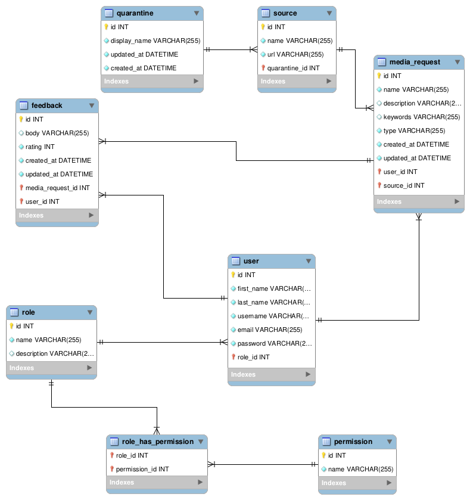

# Проєктування бази даних

## Модель бізнес-об'єктів

@startuml

    entity User
    entity User.id #FFFFFF
    entity User.username #FFFFFF
    entity User.firstName #FFFFFF
    entity User.lastName #FFFFFF
    entity User.email #FFFFFF
    entity User.password #FFFFFF

    User.username -r-* User
    User.firstName -u-* User
    User.lastName -u-* User
    User.email -u-* User
    User.password -u-* User
    User.id -l-* User

    entity Role
    entity Role.name #FFFFFF
    entity Role.description #FFFFFF
    entity Role.id #FFFFFF

    Role.name -u-* Role
    Role.description -u-* Role
    Role.id -u-* Role

    User "0.*" -d- "1.1" Role

    entity Permission
    entity Permission.name #FFFFFF
    entity Permission.id #FFFFFF

    Permission -d-* Permission.name
    Permission -d-* Permission.id

    entity RoleHasPermission

    Role "1.1" -d- "0.*" RoleHasPermission
    Permission "1.1" -u- "0.*" RoleHasPermission

    entity MediaRequest
    entity MediaRequest.id #FFFFFF
    entity MediaRequest.name #FFFFFF
    entity MediaRequest.type #FFFFFF
    entity MediaRequest.keywords #FFFFFF
    entity MediaRequest.description #FFFFFF
    entity MediaRequest.updatedAt #FFFFFF
    entity MediaRequest.createdAt #FFFFFF

    MediaRequest.id -r-* MediaRequest
    MediaRequest.name --* MediaRequest
    MediaRequest.type -u-* MediaRequest
    MediaRequest.keywords -u-* MediaRequest
    MediaRequest.description -u-* MediaRequest
    MediaRequest -u-* MediaRequest.updatedAt
    MediaRequest -u-* MediaRequest.createdAt

    User "1.1" -u- "0.*" MediaRequest

    entity Source
    entity Source.id #FFFFFF
    entity Source.name #FFFFFF
    entity Source.url #FFFFFF

    Source.id -u-* Source
    Source.name -u-* Source
    Source.url -u-* Source

    Source "1.1" -u- "0.*" MediaRequest

    entity Quarantine
    entity Quarantine.id #FFFFFF
    entity Quarantine.displayName #FFFFFF
    entity Quarantine.updatedAt #FFFFFF
    entity Quarantine.createdAt #FFFFFF

    Quarantine.id -u-* Quarantine
    Quarantine.displayName -u-* Quarantine
    Quarantine.updatedAt -u-* Quarantine
    Quarantine.createdAt -u-* Quarantine

    Quarantine "1.1" -u- "0.*" Source

    entity Feedback
    entity Feedback.id #FFFFFF
    entity Feedback.body #FFFFFF
    entity Feedback.rating #FFFFFF
    entity Feedback.createdAt #FFFFFF
    entity Feedback.updatedAt #FFFFFF

    User "1.1" -u- "0.*" Feedback
    MediaRequest "1.1" -r- "0.*" Feedback

    Feedback -r-* Feedback.id
    Feedback -d-* Feedback.body
    Feedback -u-* Feedback.rating
    Feedback -u-* Feedback.createdAt
    Feedback -u-* Feedback.updatedAt

@enduml

## ER-модель

@startuml

    namespace AccountManagement {
        entity User <<ENTITY>> {
            id: Int
            username: Text
            firstName: Text
            lastName: Text
            email: Text
            password: Text
        }
    }

    namespace AccessPolicy {
        entity Role <<ENTITY>> #ffff00 {
            id: Int
            name: Text
            description: Text
        }

        object UserRole #ffffff
        object TechnicalExpertRole #ffffff

        entity Permission <<ENTITY>> {
            id: Int
            name: Text
        }

        entity RoleHasPermission <<ENTITY>> {
            roleId: Int
            permissionId: Int
        }
    }

    namespace MediaContentManagement {
        entity MediaRequest <<ENTITY>> {
            id: Int
            name: Text
            type: Text
            keywords: Text
            description: Text
            updatedAt: Datetime
            createdAt: Datetime
        }

        entity Feedback <<ENTITY>> {
            id: Int
            body: Text
            rating: Float
            updatedAt: Datetime
            createdAt: Datetime
        }

        entity Source <<ENTITY>> {
            id: Int
            name: Text
            url: Text
        }

        entity Quarantine <<ENTITY>> {
            id: Int
            displayName: Text
            updatedAt: DateTime
            createdAt: DateTime
        }
    }

    User "0.*" -d- "1.1" Role
    User "1.1" -u- "0.*" MediaRequest
    User "1.1" -u- "0.*" Feedback
    UserRole .u.> Role
    TechnicalExpertRole .u.> Role
    MediaRequest "1.1" -r- "0.*" Feedback
    Source "1.1" -r- "0.*" MediaRequest
    Quarantine "1.1" -r- "0.*" Source
    Role "1.1" -d "0.*" RoleHasPermission
    Permission "1.1" -u "0.*" RoleHasPermission

@enduml

## Реляційна схема

  

